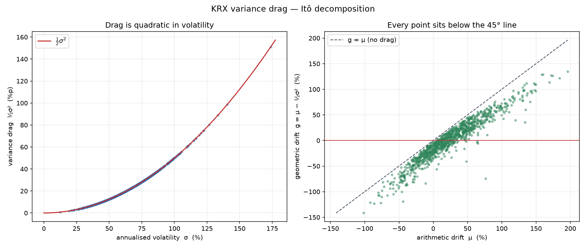

# KRX 변동성 드래그 스크리너

> 한국거래소 전 종목을 대상으로 Itô 보정항 `½σ²` 을 추정하여,
> **산술 기대수익률 μ 와 실제 복리 성장률 g 의 괴리**를 횡단면으로 순위화합니다.

[](https://github.com/PJH720/krx-vol-drag-screener/actions/workflows/ci.yml)

---

## 핵심 아이디어

기하 브라운 운동 `dS = μS dt + σS dB` 에 Itô의 보조정리를 적용하면

```
d(ln S) = (μ − ½σ²) dt + σ dB
```

즉 **데이터에서 관측되는 로그 드리프트는 μ 가 아니라 g = μ − ½σ²** 입니다.
그 차이 `D = μ − g = ½σ²` 가 **변동성 드래그**로, 기대수익률 중 복리 실현에
끝내 도달하지 못하는 부분입니다.

이 값은 σ 에 대해 **2차**로 증가합니다. σ 가 30%면 드래그는 4.5%p지만,
σ 가 90%면 40.5%p입니다. 고변동성 종목에서 "기대수익률은 높은데 계좌는 녹는"
현상의 정확한 수학적 원인입니다.

---

## 실제 실행 결과 (2026-08-16, 최근 504거래일)

| 지표 | 값 |
|---|---|
| 필터 통과 종목 | **1,106** (KOSPI + KOSDAQ, 전체 2,596개 중) |
| 중위 연변동성 σ | **65.7%** |
| 중위 드래그 ½σ² | **21.6%p** |
| 중위 드래그/μ 비율 | **61.3%** |
| μ > 0 이지만 g < 0 인 종목 | **20.7%** |

> 통과 종목의 **5분의 1이 "기대수익률은 양수인데 실제로는 원금이 줄어든"** 상태였습니다.

### 대표 종목 예시

| 종목 | σ | μ | g = μ−½σ² | 드래그 |
|---|---|---|---|---|
| SK하이닉스 | 73.3% | 130.3% | 103.4% | 26.9%p |
| 삼성전자 | 56.6% | 75.6% | 59.6% | 16.0%p |
| 현대자동차 | 53.5% | 46.1% | 31.8% | 14.3%p |
| **LG화학** | 55.8% | **+7.4%** | **−8.2%** | 15.6%p |
| **카카오** | 48.4% | **+10.4%** | **−1.3%** | 11.7%p |

LG화학과 카카오가 전형적인 **변동성 함정**입니다. 산술 평균 수익률은 양수지만,
드래그가 이를 완전히 상쇄해 매수 후 보유 시 손실이 발생했습니다.



---

## 드래그를 넷으로 나눠 보기 (v0.2)

단일 스냅샷 순위는 "지금 어느 종목이 가장 새는가"만 답합니다. v0.2는 같은 `½σ²` 를
네 방향으로 확장합니다.

### 시간축 — 롤링 드래그

이동창으로 같은 Itô 분해를 반복해 드래그가 평소 수준인지, 방금 두 배가 되었는지 봅니다.
`drag_trend` 컬럼은 최근 창과 직전 창의 차이입니다.

### 횡단면 구조 — 업종

업종별 중위 드래그와, **동일가중 업종 포트폴리오를 실제로 구성해 계산한 드래그**를
나란히 보고합니다. 둘은 같은 값이 아닙니다 — 포트폴리오 분산은 상관이 1보다 작은 만큼
감쇠하지만 개별 종목의 분산은 그렇지 않습니다. 그 간격이 분산투자 이득입니다.

### 배율 민감도 — 레버리지

일간 리밸런싱 배율 L 펀드는 `dX/X = L·dS/S` 를 따르므로

```
g_L = L·μ − ½L²σ²  =  L·g − (L²−L)·D
```

기초자산 성장률의 L배를 기대한 보유자는 정확히 `(L²−L)·D` 만큼 미달합니다.
L=2 면 2D, **L=3 과 L=−2 는 똑같이 6D** — 인버스 2배가 3배 롱과 같은 벌점을 치릅니다.

여기서 두 개의 실용적 수치가 나옵니다.

| 값 | 식 | 의미 |
|---|---|---|
| 임계 변동성 | `σ* = √(2μ/L)` | 기초 σ 가 이를 넘으면 `g_L < 0` |
| 최적 배율 | `L* = μ/σ²` | 로그 성장률을 최대화하는 켈리 배율 |

μ=10% 일 때 2배 펀드의 임계 변동성은 **31.6%** 입니다. KRX 중위 σ 가 65.7% 라는 점을
생각하면, 대부분의 한국 주식에서 2배 레버리지는 이미 임계점을 한참 넘어 있습니다.

상품 테이블의 표방 배율은 **믿지 않습니다.** 펀드의 일간 단순수익률을 기초지수에 회귀해
기울기로 배율을 실측하고, 표방값과 0.15 이상 어긋나면 리포트에 플래그를 세웁니다.

### 성분 분해 — 연속 vs 점프

실현분산은 연속 확산과 불연속 점프를 함께 담습니다. 이중멱변동은 각 수익률을 이웃과
곱해 점프의 영향을 억제하므로

```
BPV = (π/2)·(n/(n−1))·Σ|r_i||r_{i−1}|      →  연속 성분
JV  = max(RV − BPV, 0)                      →  점프 성분
```

이고, 드래그가 `½σ²_연속 + ½σ²_점프` 로 **정확히** 분해됩니다. 유의성은 BNS 비율 검정으로
판정합니다. 다만 일간 데이터는 이 분해의 점근이론이 상정하는 것보다 성긴 격자이므로,
분산이 어디서 오는지에 대한 지표로 읽되 정밀한 측정값으로 보지 마십시오.

---

## 수치 검증

추정량은 다음 항등식과 교차검증을 **매 실행마다 자동으로** 확인합니다.

| 검증 항목 | 실측 결과 |
|---|---|
| Itô 항등식 `μ − g = ½σ²` | 최대 잔차 **3.9 × 10⁻¹⁶** |
| 이차변동 `(A/n)Σr²` vs `σ̂²` | 중위 상대오차 **0.16%** |
| `μ̂` vs 단순수익률 연율 평균 | 중위 절대차 **0.0018** |

테스트 스위트는 알려진 `(μ, σ)` 로 GBM을 시뮬레이션한 뒤 추정량이
카이제곱 신뢰구간·표준오차 안에서 복원되는지 검증합니다. v0.2의 확장 계층도
같은 방식으로, 답을 아는 합성 경로에 대해 검증됩니다.

| 검증 항목 | 방법 |
|---|---|
| 롤링 = 일회성 추정 | 전체 길이 창의 마지막 행이 `compute_drag()` 와 `1e-12` 이내 일치 |
| 롤링 레짐 추적 | σ 0.20→0.60 전환 경로에서 드래그가 두 수준을 복원하고 창 안에서 전환 감지 |
| 점프 분해 항등식 | `σ²_연속 + σ²_점프 == (A/n)Σr²` 정확히 성립 |
| 점프 검정 크기 | 무점프 GBM 40개 경로에서 5% 검정의 기각 ≤ 6회 |
| 점프 복원 | Merton 점프 주입 시 `λ(μ_J² + σ_J²)` 규모의 점프 분산 복원 |
| 레버리지 공식 | 일간 리밸런싱으로 실제 구성한 Lx 경로가 `L·g − (L²−L)·D` 복원 |
| 배율 실측 회귀 | 생성 배율을 `1e-6` 이내로 복원, 잘못 표기된 상품을 플래그 |
| 분산투자 | 동일가중 포트폴리오 드래그 < 구성종목 중위 드래그 |

전체 149개 테스트, 커버리지 90% (미커버 구간은 네트워크가 필요한 다운로드 경로).

---

## 설치

```bash
git clone https://github.com/PJH720/krx-vol-drag-screener.git
cd krx-vol-drag-screener

python -m venv .venv && source .venv/bin/activate
pip install -e ".[dev]"
```

## 사용법

```bash
# 전 종목 스크리닝
krxdrag

# KOSPI만, 최근 1년, 상위 40개 리포트
krxdrag --markets KOSPI --lookback 252 --top 40

# 유동성 기준 상향 (일 거래대금 50억 이상)
krxdrag --min-turnover 5e9

# 자기완결 HTML 리더보드까지 생성
krxdrag --html

# 레버리지 ETF 감사 포함 (추가 가격 데이터를 내려받습니다)
krxdrag --etf

# 롤링 창을 1년으로, 업종은 10종목 이상만
krxdrag --rolling-window 252 --min-sector-names 10

# 무거운 계층 끄기
krxdrag --no-sectors --no-jumps --rolling-window 0

# 캐시 무시하고 재다운로드
krxdrag --no-cache
```

산출물은 `reports/` 에 CSV · Markdown · PNG 로 저장되며, `--html` 을 주면
차트를 base64 로 품은 **단일 HTML 파일**이 함께 생성됩니다. 외부 참조가 전혀 없어
`file://` 로 열어도 그대로 동작합니다.

### 라이브러리로 사용

```python
from krxdrag import compute_drag, screen, ScreenConfig

# 단일 시계열
m = compute_drag(prices)
print(m.mu, m.g, m.drag)             # 산술 / 기하 / 드래그
print(m.sigma_sq_lo, m.sigma_sq_hi)  # σ² 카이제곱 신뢰구간

# 전 종목
df = screen(ScreenConfig(lookback_days=252, markets=("KOSPI",)))
```

```python
from krxdrag import (
    decompose_jumps, rolling_drag, drag_trend,
    aggregate_sectors, leveraged_metrics, critical_volatility,
)

# 드래그를 연속 성분과 점프 성분으로 분해
j = decompose_jumps(log_returns(prices))
print(j.drag_cont, j.drag_jump, j.bns_pvalue)

# 시간에 따른 드래그
rd = rolling_drag(prices, window=126)     # 창 종료일별 σ, g, μ, 드래그
print(drag_trend(prices))                 # 최근 창 − 직전 창

# 업종 집계
print(aggregate_sectors(df, min_names=5))

# 2배 레버리지가 무엇을 잃는가
lm = leveraged_metrics(m, leverage=2.0)
print(lm.levered_g, lm.drag_penalty)      # (L²−L)·D 만큼 미달
print(critical_volatility(m.mu, 2.0))     # 이 σ 를 넘으면 g_L < 0
```

---

## 구조

```
src/krxdrag/
├── metrics.py       Itô 분해 · 추정량 · 표준오차 · 신뢰구간
├── volatility.py    범위 기반 σ² (Parkinson/GK/RS/Yang–Zhang) · 가격제한폭 탐지
├── validation.py    표본외 지속성 — 어떤 추정량이 다음 기간까지 살아남는가
├── diagnostics.py   정규성(JB) · 변동성 군집(Ljung–Box) · GBM 적합도
├── jumps.py         이중멱변동 — 드래그의 연속/점프 성분 분해
├── rolling.py       이동창 드래그 · 추세 · 횡단면 시계열
├── sectors.py       업종 집계 · 동일가중 포트폴리오 드래그
├── leverage.py      배율별 성장률 · 임계 변동성 · ETF 배율 감사
├── universe.py      KRX KIND 상장법인목록 (공식 · 실시간)
├── data.py          yfinance 배당조정 가격 + parquet 캐시
├── screener.py      횡단면 스크리닝 엔진
├── report.py        Markdown / CSV / 차트 / 자기완결 HTML 출력
└── cli.py           커맨드라인 인터페이스
```

**데이터 출처**
- 유니버스: [KRX KIND](https://kind.krx.co.kr) 상장법인목록 (거래소 공식)
- 가격: yfinance (`auto_adjust=True` — 배당·액면분할 조정)

---

## 변동성 추정량 (v0.3 P16)

드래그는 전적으로 `σ²` 의 함수인데, 메인 순위의 `σ` 는 **종가 대비 표본분산** — 일중에
가격이 무엇을 했는지 전부 버리는, 가장 비효율적인 추정량입니다. `volatility.py` 는 봉
전체를 읽는 네 가지 추정량을 함께 계산해 **나란히** 보고합니다.

측정한 효율(일간 추정치 분산 기준, 종가 대비): Parkinson **5.0배**, Garman–Klass
**7.6배**, Rogers–Satchell **6.1배**. 인용이 아니라 일중 GBM 시뮬레이션으로 직접 쟀습니다.

기본값은 **Yang–Zhang** 입니다. 두 가지 실패 양상이 그렇게 정했습니다.

**드리프트.** Parkinson·Garman–Klass 는 드리프트를 0으로 가정합니다. 드리프트를 올리면
Parkinson 의 편의가 **+30%** 까지 벌어지는 반면 Rogers–Satchell 은 −4% 로 평평합니다.
크기보다 **편의가 μ 와 함께 증가한다**는 점이 결정적입니다 — σ² 오차가 μ 와 상관되면
이 프로젝트가 설명하려는 드래그–μ 관계 자체가 오염됩니다.

**오버나이트 갭.** Parkinson·Garman–Klass·Rogers–Satchell 은 하나의 봉 안에서만
계산되므로 종가에서 다음 시가로 건너뛰는 움직임을 보지 못합니다. 변동성의 40%가 갭에
있으면 이들은 σ² 를 **약 42% 과소평가**합니다. 서울장이 닫힌 사이 해외 시장이 움직이는
한국 주식에서 이는 반올림 오차가 아닙니다. Yang–Zhang 만이 드리프트에 강건하면서 갭
항을 갖습니다.

### 왜 메인 순위는 여전히 종가 대비 값인가

범위 기반 추정량은 **모두 하방 편의**를 갖습니다. 연속시간의 진짜 고·저가는 관측되지
않고 체결된 것의 극값만 보이므로, 체결이 성길수록 관측 범위가 좁아집니다. 편의는
촘촘한 종목의 −3% 에서 얇은 종목의 −24% 까지 갑니다 — 즉 **편의가 유동성과 상관됩니다.**

효율만 보고 갈아탔다면 저유동성 종목의 드래그가 체계적으로 과소평가되어 **횡단면 순위가
유동성 방향으로 조용히 기울었을 것**입니다. 그래서 범위 기반 값은 종가 대비 값을
대체하지 않고 **덧붙여** 보고하며, 리포트는 유동성 구간별 괴리표를 함께 싣습니다.
그 표가 단조롭게 기울어 있다면 그것은 표본 추출의 산물이지 얇은 종목이 실제로 덜
변동적이라는 뜻이 아닙니다.

KRX ±30% 가격제한폭에 걸린 봉은 범위가 규칙으로 잘리므로 별도로 세어 보고합니다.

---

## «유의한 점프» 의 절반은 우연이었습니다 (v0.3 P18)

진단은 종목마다 한 번씩 돌아가는 가설검정입니다. 1,106종목에 유의수준 5%로 검정하면
**모든 귀무가설이 참이어도 우연히 약 55건이 «유의»하게 나옵니다.** 보정 없는 기각 수는
그 자체로 증거가 되지 못합니다.

Benjamini–Hochberg는 기각된 것들 중 거짓의 기대 비율(FDR)을 통제합니다. 세 검정이
보정에 반응하는 정도는 완전히 다릅니다:

| 검정 | 보정 전 | FDR 보정 후 | 제거된 비율 |
|---|---|---|---|
| 정규성 (Jarque–Bera) | 1,070 | 1,070 | **0%** |
| 변동성 군집 (Ljung–Box) | 716 | 666 | 7% |
| 점프 유의 (BNS) | 247 | **120** | **51%** |

정규성 검정은 거의 모든 종목을 기각하므로 보정이 아무것도 바꾸지 않습니다. 반면
**점프 검정은 보정 전 «유의» 판정의 절반이 우연이었습니다.** v0.2가 보고하던
`has_jumps` 수치는 그만큼 과대주장이었습니다.

세 검정은 서로 다른 질문을 하므로 **각각 따로** 보정합니다 — 한데 묶으면 압도적으로
기각되는 정규성 검정이 나머지의 임계값을 끌고 다니게 됩니다.

리포트는 보정 전·후 기각 수를 «우연 기대치»와 **나란히** 싣습니다. 보정 전 수치가
우연 기대치 근처면 잡음과 구별되지 않고, 한참 위면 실재하는 효과입니다.

---

## 핵심 주장을 실제로 재봤습니다 (v0.3 P17)

이 README는 첫 커밋부터 "σ²은 μ보다 정확히 추정되므로 드래그가 더 믿을 만하다"고
주장해 왔습니다. **한 번도 측정한 적은 없었습니다.** `validation.py`가 그 측정입니다.

이력을 **겹치지 않는** 창으로 자르고(겹치면 공유된 관측치가 지속성을 만들어냅니다),
창 t의 추정치가 창 t+1의 실현값을 얼마나 맞히는지 봅니다.

| 추정량 | 순위 지속성 ρ | 표본외 R² | 잡음 상한 |
|---|---|---|---|
| σ² (= 드래그) | **0.97** | +0.89 | 0.95 |
| g | 0.12 | −0.81 | 0.14 |
| μ | **0.10** | **−0.85** | 0.11 |

주장은 성립했고, **크기까지 이론과 맞았습니다.** 추정치가 «참값 + 잡음»이면 횡단면
상관은 `Var(신호)/(Var(신호)+Var(잡음))`이 되는데, `metrics.py`의 표준오차로 계산한
예측값은 σ² 0.950 · μ 0.072였고 측정된 Pearson은 0.946 · 0.070이었습니다.

**μ의 표본외 R²가 음수**라는 점이 가장 중요합니다. 직전 창의 μ̂를 예측으로 쓰는 것이
횡단면 평균을 그냥 찍는 것보다 **나쁘다**는 뜻입니다 — 순위가 약한 정도가 아니라
정보가 음(陰)입니다. "순위를 투자 신호로 읽지 마십시오"라는 이 README의 경고는
이제 근거가 있는 문장입니다.

드래그 `½σ²`는 `σ²`의 단조 변환이므로 두 행의 순위 지속성은 정의상 같습니다 —
"드래그 순위가 안정적"과 "분산 순위가 안정적"은 두 개의 증거가 아니라 한 문장입니다.

**대조군.** 모든 종목이 같은 참 σ를 갖는 패널에서는 σ² 지속성이 0.97에서 **0.04**로
붕괴합니다. 이 지표는 "분산은 원래 재기 쉽다"가 아니라 실제 횡단면 신호를 잽니다.

---

## 가정 위반에 대한 정직한 보고

GBM은 일간 로그수익률이 iid 정규분포를 따른다고 가정하지만, 실제 주가는 그렇지 않습니다.
본 스크리너는 이를 감추지 않고 **모든 종목에 대해 함께 보고**합니다.

실측 결과, 1,106개 종목 중

- Jarque–Bera 정규성 검정을 통과한 종목: **0.1%**
- 제곱수익률 Ljung–Box(변동성 군집 없음)를 통과한 종목: **25.3%**

(위 두 수치는 보정 전 값입니다. 기각률이 워낙 높아 FDR 보정이 거의 바꾸지 않습니다 —
보정이 실질적으로 작동하는 곳은 점프 검정이며, 자세한 것은 P18 절을 보십시오.)

즉 **거의 모든 한국 주식이 GBM 가정을 위반**합니다. `gbm_score` 컬럼(0~1)은
이 위반 정도를 요약한 것으로, 점수가 낮은 종목의 순위는 그만큼 할인해서
해석해야 합니다.

다만 이것이 드래그 개념 자체를 무효화하지는 않습니다. `½σ²` 는 실현 변동성의
직접적 함수이고, σ² 추정은 μ 추정보다 훨씬 정확합니다.

---

## 한계

1. **μ 의 표준오차는 매우 큽니다.** 드리프트 추정은 본질적으로 어렵습니다.
   순위를 투자 신호로 해석하지 마십시오.
2. σ² 은 상대적으로 정확하므로 드래그 `½σ²` 자체는 μ 보다 신뢰할 만합니다.
3. 과거 실현 변동성이며 미래 예측이 아닙니다.
4. 상장폐지 종목이 유니버스에서 제외되므로 **생존 편의**가 존재합니다.
5. **업종 중위 드래그는 업종 포트폴리오의 드래그가 아닙니다.** 리포트는 두 값을
   나란히 싣습니다. 혼동하면 업종 보유 비용을 과대평가하게 됩니다.
6. 점프 분해의 점근이론은 일간보다 촘촘한 격자를 상정합니다.
7. 레버리지 ETF 상품 테이블의 코드·배율은 KRX 원본 확인이 필요합니다.
   코드는 이를 신뢰하지 않고 실측 회귀로 검증해 불일치를 보고합니다.
8. **본 도구는 교육·연구 목적이며 투자 자문이 아닙니다.**

---

## 향후 계획

전체 로드맵은 [`ROADMAP.md`](ROADMAP.md)를 참조하십시오.
롤링 · 업종 · 레버리지 · 점프 분해는 v0.2에서 구현되었습니다.

**v0.3의 주제는 «추정의 질»입니다.** v0.1은 드래그를 계산했고 v0.2는 그것을 네 방향으로
쪼갰지만, `½σ̂²` 이라는 숫자가 얼마나 믿을 만한지는 두 릴리스 모두 다루지 않았습니다.

- ✅ **범위 기반 변동성 추정량** (P16, 구현 완료) — `volatility.py` 참조.
- ✅ **핵심 주장의 측정** (P17, 구현 완료) — `validation.py` 참조.
- ✅ **다중검정 보정** (P18, 구현 완료) — 아래 참조.
- **결과 저장소** (P19), **2차 데이터 소스와 생존 편의 아카이브** (P20),
  **React 리더보드 카드** (P21)

## 라이선스

MIT
